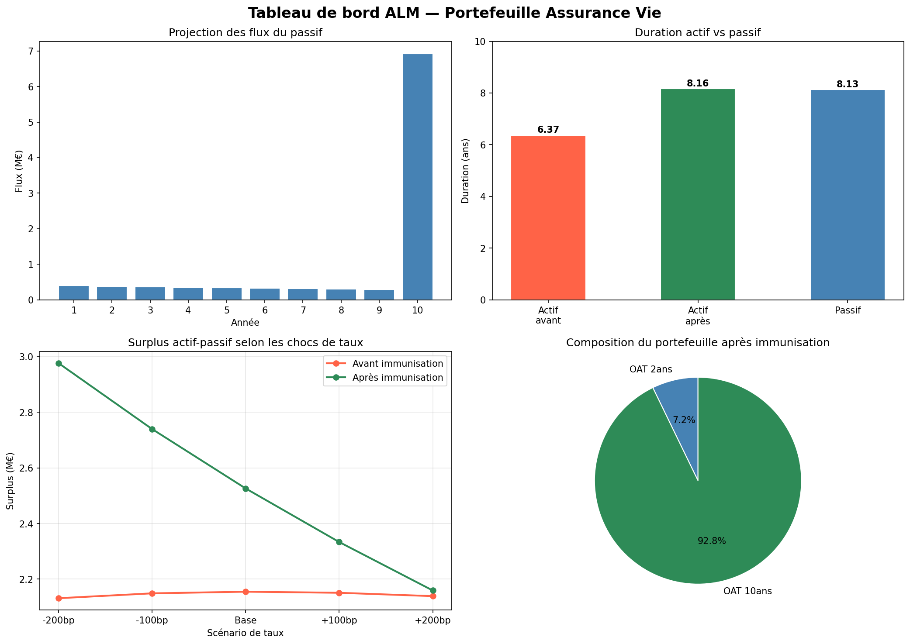

# alm-project
Modélisation ALM — gap actif-passif et immunisation sous Python
# Modélisation ALM — Gap Actif-Passif et Immunisation

## Contexte métier

En assurance Vie, l'assureur s'engage à verser des capitaux futurs à ses assurés.
Ces engagements (le passif) sont financés par un portefeuille d'actifs obligataires.

L'ALM (Asset Liability Management) consiste à s'assurer que ces deux côtés du bilan
réagissent de la même façon aux variations de taux d'intérêt. Un écart de sensibilité
entre actif et passif — appelé gap de duration — expose l'assureur à des pertes
économiques en cas de mouvement de taux.

Ce projet modélise ce mécanisme de façon simplifiée et propose une stratégie
d'immunisation pour neutraliser ce risque.

---

## Structure du projet

| Module | Description |
|---|---|
| 1 | Projection des flux du passif (rachats, décès, échéance) |
| 2 | Construction du portefeuille obligataire et calcul des durations |
| 3 | Calcul de la duration du passif |
| 4 | Mesure du gap actif-passif |
| 5 | Stress tests de taux et stratégie d'immunisation |
| 6 | Tableau de bord de visualisation |

---

## Résultats clés

| Indicateur | Valeur |
|---|---|
| Valeur actuelle du passif | 7 834 420 € |
| Valeur totale du portefeuille actif | 9 989 323 € |
| Duration Macaulay du passif | 8.13 ans |
| Duration Macaulay de l'actif avant immunisation | 6.37 ans |
| Gap avant immunisation | 1.76 ans |
| Duration Macaulay de l'actif après immunisation | 8.16 ans |
| Gap après immunisation | -0.03 ans |

### Stress tests — avant immunisation

| Scénario | Valeur Actif | Valeur Passif | Surplus |
|---|---|---|---|
| -200bp | 11 335 177 € | 9 203 729 € | 2 131 449 € |
| -100bp | 10 633 660 € | 8 484 648 € | 2 149 012 € |
| Base | 9 989 323 € | 7 834 420 € | 2 154 903 € |
| +100bp | 9 396 705 € | 7 245 686 € | 2 151 019 € |
| +200bp | 8 850 930 € | 6 711 942 € | 2 138 988 € |

### Stress tests — après immunisation

| Scénario | Valeur Actif | Valeur Passif | Surplus |
|---|---|---|---|
| -200bp | 12 180 514 € | 9 203 729 € | 2 976 785 € |
| -100bp | 11 224 449 € | 8 484 648 € | 2 739 801 € |
| Base | 10 360 634 € | 7 834 420 € | 2 526 214 € |
| +100bp | 9 579 149 € | 7 245 686 € | 2 333 463 € |
| +200bp | 8 871 233 € | 6 711 942 € | 2 159 291 € |

---

## Dashboard

---

## Outils utilisés

- Python 3.9
- pandas, numpy, matplotlib

---

## Limites et extensions possibles

- **Courbe de taux** : taux plat utilisé ici — en pratique on utilise la courbe EIOPA Solvabilité II
- **Immunisation** : deux obligations seulement — en pratique un optimiseur sur le portefeuille complet avec contraintes de diversification
- **Rachats dynamiques** : taux de rachat fixe ici — en pratique ils dépendent du niveau des taux
- **Modèle stochastique** : extension possible avec Vasicek ou Hull-White pour simuler des trajectoires de taux

---

## Auteur

**Hasina Raveloson**  
Master Actuariat — ISUP Sorbonne Université  
ravelosonsarobidy7@gmail.com  
[LinkedIn](https://www.linkedin.com/in/hasina-sarobidy-raveloson)
